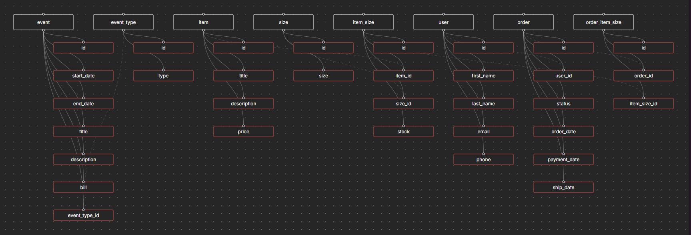

# DB Documentation

## Schema

## Prisma documentation

Link to prisma doc : [Prisma Documentation](https://www.prisma.io/docs/getting-started/setup-prisma/start-from-scratch/relational-databases-typescript-prismaPostgres)

## Admin BDD

---

### Connection

#### VM
bash
docker exec -it bedbusters-bedbusters_db-1 sh

#### PSQL Docker

bash
psql -U bedbusters_app -d bedbusters_db

#### Exit

1. `\q`
2. `exit`

---

### Edit Stock
sql
UPDATE item_size
SET stock = 6
WHERE id = (
    SELECT "item_size"."id"
    FROM "item_size"
    JOIN "item" ON "item_size"."itemId" = "item"."id"
    JOIN "size" ON "item_size"."sizeId" = "size"."id"
    WHERE "item"."title" = 'Tee-shirt Bedbusters' AND "size"."size" = 'L'
);

---

### View stock
sql
SELECT * FROM stock_view;

---

### View order
sql
SELECT * FROM order_view;

---

### Change order status PAID
sql
UPDATE "order"
SET status = 'PAID'
WHERE id = ;

---

### Change order status FINISHED
sql
UPDATE "order"
SET status = 'FINISHED'
WHERE id = ;
